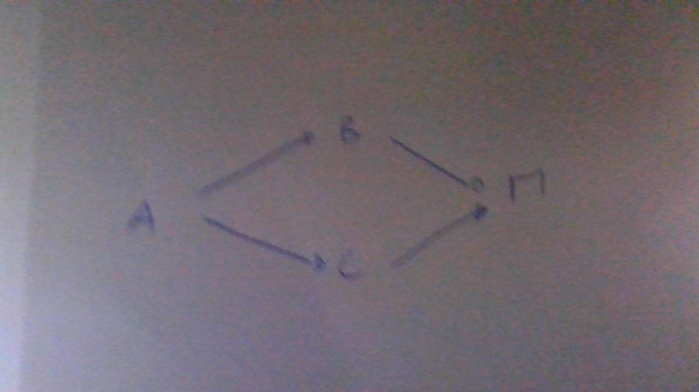

 1. Dessin du graphe (à la main)

Le dessin représente :
- A = point de divergence (Premier commit)
- Deux flèches partent de A : une vers B (sur la branche feature), une vers C (sur main)
- B et C convergent tous les deux vers M (le commit de fusion)

(voir photo jointe / description ci-dessus)

 2. Sortie de `git log --oneline --graph --all`
f033ba9 (HEAD -> main) Fusion de feature dans main
|
| * db959b1 (feature) Ajout sur feature
| ad4a6cf Correctif sur main
|/
3c7823b Premier commit

 3. Correspondance entre les deux

- Le commit **3c7823b** (Premier commit) correspond au point **A** de mon dessin : c'est le point de divergence.
- Le commit **ad4a6cf** (Correctif sur main) correspond au point **C** : c'est le commit fait directement sur main après la divergence.
- Le commit **db959b1** (Ajout sur feature) correspond au point **B** : c'est le commit fait sur la branche feature.
- Le commit **f033ba9** (Fusion de feature dans main) correspond au point **M** : c'est là où B et C se rejoignent, visible dans le graphe par le `|\` (séparation) et le `|/` (réunion).